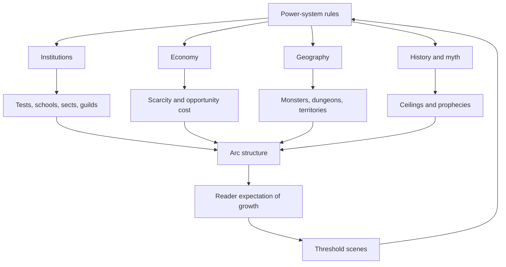

# How Main Character Progression Is Woven Into Progression Fantasy Stories

## Executive Summary

Across progression fantasy, the most important narrative fact is not that protagonists level up. It is that advancement is made to matter before it is measured. The strongest series do this by tying growth to humiliation, debt, grief, class position, family duty, prophecy, institutional exclusion, or survival. In other words, the reader is taught to care about progression because progression solves, worsens, or reframes a story problem that already hurts. Andrew Rowe argues that progression fantasy is a content descriptor in which growth is a significant part of plot and motivation, and that its tropes include shown training methods, eccentric mentors, and tournament structures. The corpus below repeatedly confirms that claim. citeturn34view3turn24view2

A second cross-series pattern is that authors rarely deliver progression as pure exposition. They distribute it through scene types: initiation tests, school evaluations, travel hazards, public humiliation, duels, puzzle rooms, raid failures, sect chores, farm labor, research sessions, and boss encounters. Those scenes do triple duty. They teach rules, move plot, and expose character. Rowe explicitly warns against skipping the growth process and stresses effort-reward legibility; Bierce emphasizes hard-rule consistency; Tao Wong highlights the appeal of watching someone grow from weak to strong; Sarah Lin and Dinniman show how those same structures can be redirected into class critique or satire without losing the forward pull of accumulation. citeturn24view2turn24view4turn34view4turn18search16turn30view5turn38view1

The twenty-series corpus also shows that progression fantasy is not one pacing model. Fast stair-step series like Cradle, Solo Leveling, and Iron Prince create a rhythm of test, gain, social re-ranking, and larger threat. Slower works like Forge of Destiny, A Thousand Li, and Beware of Chicken let advancement reshape relationships, institutions, and daily life before cashing it out in climactic force. Time-loop stories like Mother of Learning make repetition itself the engine of both competence and character change. LitRPG-system works often tether growth to quest loops, but the best of them, such as Dungeon Crawler Carl, Defiance of the Fall, and He Who Fights with Monsters, also make power a social, political, or performative burden. citeturn29view9turn37view0turn38view2turn32view1turn29view0turn37view3turn30view3turn38view1turn31view5turn24view13

The most durable narrative techniques in this field are remarkably consistent. Authors externalize status early. They visualize world rules through institutions. They use mentors and rivals as moving tutorial devices. They delay full explanation until the protagonist can act on a fragment of it. They let each threshold change social geometry, who respects the hero, who fears them, who can teach them, and what doors now open. They also preserve reader engagement by alternating compression and release: hard challenge, small synthesis scene, new promise, then a wider arena. That beat pattern is visible in academy fantasies, xianxia, portal fantasy, dungeon survival, and system apocalypse alike. citeturn24view0turn24view1turn24view2turn34view3turn24view4

My core conclusion is simple: progression fantasy works best when the author treats advancement as the story’s operating grammar, not as a scoreboard pasted on top of it. The works below differ drastically in tone, subgenre, and speed, but they converge on one principle: every increase in capability should also change what the story can now be about. citeturn34view3turn24view2

## Method and Corpus

I cannot verify exact model training-set membership, so I treated your training-data requirement as a best-effort constraint rather than a verifiable fact. I therefore selected twenty representative progression-fantasy series that are widely recognized within the field or function as major precursors, and for which I could verify setup, mechanics, and framing through official series pages, primary web-serial pages, publisher copy, or author craft commentary. For works with openly available serial text, especially Royal Road, Tapas, and Wuxiaworld, I leaned more heavily on primary-text hosting pages. For craft synthesis, I prioritized author essays and interviews where available, especially Andrew Rowe, John Bierce, Will Wight, and Tao Wong. citeturn34view3turn24view2turn24view4turn34view4turn29view12turn29view9turn29view0

All scene examples below are paraphrased analytical summaries, not quotations. The goal is not exhaustive plot recap. It is to identify how each author uses scene construction, failure, NPCs, world rules, exposition placement, POV control, and pacing beats to integrate progression into the larger narrative machine. Where genre-fit classification might be debated, I label confidence explicitly in the comparative table. Rowe’s own genre framing is especially useful here, because he explicitly names Cradle, Iron Prince, Street Cultivation, and Mage Errant as progression-fantasy mainstays across different settings, which supports a trans-subgenre comparison rather than a narrow LitRPG-only approach. citeturn34view3turn29view9turn37view0turn30view5turn29view11

## Comparative Map

The table below focuses on how progression enters story structure, not just what the mechanics are.

| Series | Mode | Mechanics interface | POV | Pacing | Stakes anchor | Distinct integration move | PF-fit confidence |
|---|---|---|---|---|---|---|---|
| Cradle citeturn29view9turn34view3 | Western cultivation | sacred arts tiers, Paths, treasures | close third | brisk staircase | shame, survival, destiny | each threshold changes map scale and self-worth | High |
| Traveler’s Gate citeturn29view12turn34view0 | portal-action precursor | territory rooms, itemized trials | close third | fast | revenge, local catastrophe | location itself serves as training montage and lore engine | High, precursor |
| Arcane Ascension citeturn29view10turn34view2turn24view0 | academy-dungeon | attunements, item craft, tower trials | first person | medium-fast | family loss, school competition | school and dungeon alternate to pace rule exposure | High |
| Mage Errant citeturn29view8turn24view4 | academy-team | affinities, practical spellcraft | close third | medium | social failure, war escalation | niche specialization keeps ensemble relevant | High |
| Mother of Learning citeturn30view3 | time-loop academy | repeated practice, mind magic, investigation | close third | elastic, selective montage | escape loop, invasion mystery | scene selection turns repetition into meaning | High |
| Forge of Destiny citeturn32view1turn32view0 | sect-social cultivation | arts, resources, social advancement | close third | slow burn | class mobility, sect survival | cultivation is inseparable from etiquette and politics | High |
| Street Cultivation citeturn30view5turn25view5 | urban cultivation | qi as capital, fights, debt, contracts | close third | medium | poverty, family care | growth is framed as labor and economic risk | High |
| The Weirkey Chronicles citeturn33view0turn33view3 | world-hopping cultivation | soulhome construction, materials, prior-life knowledge | close third | medium | betrayal, second chance | literal building mechanic externalizes interior growth | High |
| A Thousand Li citeturn29view0 | grounded xianxia | sect discipline, philosophy, gradual realms | close third | patient | peasant fate, survival, duty | advancement is earned through habit and worldview | High |
| Coiling Dragon citeturn25view10turn13search3 | translated xuanhuan gateway | ranks, bloodline, laws, artifacts | close third | steady escalation | family honor, revenge, cosmology | each realm reveal opens a larger ontological layer | High |
| The Beginning After the End citeturn25view0turn36search3turn36search9 | reincarnation fantasy | mana core growth, elemental training, war scaling | first person / close | medium-fast | second-life correction, protection | adult memory inside child body turns growth into moral redo | High |
| Iron Prince citeturn37view0turn34view3 | military academy sci-fi | CAD specs, ranks, team training, tournaments | close third | fast | bodily weakness, merit, spectacle | statistics matter because institutions rank them publicly | High |
| Bastion citeturn38view0 | infernal academy progression | Great Soul ranks, memory, academy ascent | close third | medium-fast | betrayal, lost past, return climb | vertical geography mirrors social and power ascent | High |
| Mark of the Fool citeturn37view5turn29view2 | academy with divine handicap | mark constraints, side-channel growth, research | close third | medium | autonomy, prophecy refusal | negative capability creates inventive progression routes | High |
| Beware of Chicken citeturn37view3turn30view2 | xianxia inversion | cultivation through domestic labor, community flourishing | first person / close | leisurely | peace, belonging, anti-genre refusal | delayed conflict makes quiet growth feel momentous | High |
| He Who Fights with Monsters citeturn24view13turn30view4 | portal LitRPG | essence powers, questing, team role synergy | close third | medium-fast | identity, morality, world politics | voice and banter carry heavy exposition loads | High |
| Defiance of the Fall citeturn31view5turn29view3 | system apocalypse-cultivation | levels, classes, dao, empire advancement | close third | expansive | survival, Earth defense, multiverse politics | town-building and cosmic scaling run in parallel | High |
| The Primal Hunter citeturn31view1turn28search17 | tutorial-to-multiverse LitRPG | levels, professions, evolutions, alchemy | close third | fast with regular breathers | self-actualization, challenge hunger | self-directed hunting identity stabilizes long-scale growth | High |
| Dungeon Crawler Carl citeturn38view1 | satirical dungeon LitRPG | floors, achievements, viewer economy, loot | first person | rapid episodic | survival, performance, trauma | game-show framing turns power into entertainment labor | High |
| Solo Leveling citeturn38view2turn29view5turn26search11 | dungeon-raid progression | hidden quests, stat growth, shadow extraction | close third | very rapid | family bills, survival, world defense | solitary acceleration drives a series of social re-reveals | High |

Two broad structural relationships recur across the corpus.

The diagrams capture the central finding. Power systems are not isolated mechanics. They produce institutions, scarcity, maps, myths, and arc design. That is why progression fantasy can sustain long series without becoming empty number inflation when it is done well. citeturn24view1turn24view2turn24view4turn34view3

## Foundational and Academy Modes

**Cradle**

Summary: Cradle follows Lindon, born among the weakest practitioners in a cultivation hierarchy, as he pushes from social nullity toward the highest tiers of sacred arts. Mechanics center on madra aspects, Paths, treasures, cycling, and threshold realms, but the real narrative move is that every increase in power changes who can dismiss, exploit, mentor, or fear him. citeturn29view9turn35view2

| Scene-level example | How progression is embedded | Main techniques |
|---|---|---|
| Unsouled judgment | Advancement begins as stigma. The opening makes low status a public wound, so strength equals dignity before it equals violence. | show-first status wound, socialized rules |
| Festival cheating and study | Lindon’s early “progress” is cunning and preparation, which teaches that ingenuity is a valid precursor to raw power. | competence framing, effort-reward |
| Suriel’s intervention | A cosmic vision converts self-improvement into existential urgency and foreshadows scale far beyond the valley. | revelation beat, horizon expansion |
| Yerin rescue and escape | Growth is tied to flight, alliance, and survival, not a detached training block. | plot-embedded training, mentor arrival |
| Blackflame path adoption | A new combat Path also becomes a choice about identity, danger tolerance, and future enemies. | character-choice threshold |
| Later thresholds such as Underlord | Major realm advances coincide with self-redefinition and widened responsibility, not just stronger attacks. | thematic breakthrough, scale recalibration |

Technique profile: Wight relies on visible humiliation, tightly staged threshold scenes, and repeated social re-sorting. He explains rules after or during use, not before, and uses stronger NPCs as living foreshadowing of later ceilings. citeturn24view2turn29view9

**Traveler’s Gate**

Summary: In Traveler’s Gate, Simon becomes powerful by surviving the impossible interior trials of Valinhall and related Territories. The narrative innovation is spatial: progression lives inside places, so exploration, training, and exposition are one activity. citeturn29view12turn34view0

| Scene-level example | How progression is embedded | Main techniques |
|---|---|---|
| Village destruction | Simon’s lack of chosen-one status makes advancement a response to helplessness and resentment. | anti-chosen framing, wound first |
| Entry into Valinhall | The house itself becomes a scene machine that teaches power through ordeal rooms. | environmental tutorial |
| Room-by-room trials | Each room is both a test and a narrative reveal, so lore is discovered kinetically. | show over tell, episodic escalation |
| Incarnation contrast | Enemies model what unbalanced devotion to a power source looks like, foreshadowing Simon’s risks. | mirror-rivals, cost foreshadowing |
| Leah and Kai interactions | Other power trajectories keep the plot from collapsing into a solo ladder. | ensemble comparison |
| Final urban confrontations | Earlier internal trials pay off in public combat, converting private growth into visible heroism. | payoff structure, earned competence |

Technique profile: The series is fast and sometimes deliberately rough-edged, but its core lesson is valuable for authors: if the power source is also a location, then every visit can advance plot, worldbuilding, and character at once. citeturn29view12turn34view0

**Arcane Ascension**

Summary: Corin Cadence enters a tower-linked academy after his brother disappears in a spire trial. Attunements, enchanting, dungeon pathways, and school hierarchy provide structure, but the deeper narrative engine is unresolved family grief and institutional mystery. citeturn29view10turn34view2turn24view0

| Scene-level example | How progression is embedded | Main techniques |
|---|---|---|
| Serpent Spire judgment | The opening trial uses danger, puzzle-solving, and family absence to weld mechanics to character motive. | initiation scene, emotional stakes |
| Attunement reveal | Power is immediately social, because the mark determines status, expectations, and future niche. | world rule via status |
| Early school classes | Exposition becomes bearable because it arrives as competition, experimentation, or problem-solving. | lesson-as-scene |
| Enchanter specialization | Corin’s build channels progression into logistics and item craft, which supports plot utility beyond duels. | niche design, indirect power |
| Team dungeon dives | Advancement requires complementary roles, so friendships and trust are part of the build. | ensemble dependency |
| Brother mystery and tower politics | Every gain gives Corin new capacity to investigate, making progression an investigative escalator. | mystery-progression braid |

Technique profile: Rowe is especially strong at using institutions as exposition filters. He also emphasizes multiple relevant roles, which keeps side characters from becoming dead weight as the hero grows. citeturn24view0turn24view2

**Mage Errant**

Summary: Hugh of Emblin begins as an academy failure who is suddenly chosen by an unconventional mentor. The series treats magical growth as practical fit: weakness is not erased first, it is recontextualized until it becomes a usable specialty. citeturn29view8turn29view11turn24view4

| Scene-level example | How progression is embedded | Main techniques |
|---|---|---|
| Hugh as “worst student” | The opening grounds advancement in embarrassment, isolation, and fear of public failure. | shame hook, sympathetic weakness |
| Alustin’s choosing | A mentor’s recognition converts a deficit story into a latent-fit story. | mentor reframing |
| Affinity practice | Power grows through concrete exercises, not mystical vagueness. | hard-rule dramatization |
| Labyrinth exam | Skill growth is validated in a dangerous institutional test that also deepens group bonds. | plot-integrated exam |
| Team specialization arcs | Friends’ unusual affinities create parallel progression tracks and strategic interdependence. | ensemble niches |
| Traitor and war escalations | Mastery stops being academic when political structures crack and every competency becomes tactical. | scale shift, world consequence |

Technique profile: Bierce’s hard-magic preference matters narratively because it lets readers predict consequences. That predictive pleasure is one of the genre’s core engagement engines. citeturn24view4turn34view4

**Mother of Learning**

Summary: Zorian Kazinski is trapped in a month-long time loop and forced to solve the mystery behind it while repeatedly expanding his magical competence and social world. The series shows how selective repetition can make progression both rigorous and dramatically efficient. citeturn30view3

| Scene-level example | How progression is embedded | Main techniques |
|---|---|---|
| Irritable academy start | Zorian’s initial pettiness gives him emotional room to grow alongside skill. | flawed baseline |
| First death and reset | The loop literalizes practice, but it also turns learning into a mystery-solving tool. | premise lock, training engine |
| Repeated class cycles | The narrative skips repetitions that are no longer interesting and dramatizes only new friction. | selective montage |
| Mind magic and networking | Advancement increases the range of people Zorian can understand and recruit, not only his firepower. | social progression |
| Partnership with Zach | Rival and ally energy transforms solitary grinding into dynamic scene work. | relational reframing |
| Final siege payoff | The endgame is satisfying because tiny earlier competencies become tactically essential. | long-payoff architecture |

Technique profile: This is one of the clearest demonstrations that progression pacing is really scene-selection pacing. The author does not show every repetition. He shows the repetitions that alter strategy, affiliation, or self-understanding. citeturn30view3

## Cultivation and Social Modes

**Forge of Destiny**

Summary: Ling Qi rises from urban poverty into a major sect, where cultivation is inseparable from social intelligence, patronage, factional pressure, and symbolic presentation. The novel’s signature move is to make cultivation a relational art instead of a solitary climb. citeturn32view1turn32view0

| Scene-level example | How progression is embedded | Main techniques |
|---|---|---|
| Talent discovery in the slums | Power begins as forced relocation and class rupture, not wish fulfillment. | class-displacement hook |
| Sect intake | Progress requires not just qi control but etiquette, alliance reading, and self-protection. | institution as rule tutor |
| Early dorm politics | Small gains matter because they shift how peers evaluate and target Ling Qi. | social stakes |
| Artistic and spiritual cultivation | Training scenes deepen worldview and identity rather than merely broadening attack options. | thematic cultivation |
| Violence ban expiry and faction stress | Power and social positioning become mutually reinforcing survival tools. | timed pressure, foreshadowing |
| Later missions and courtly maneuvering | As the world expands, progress becomes political literacy plus strength. | worldbuilding through advancement |

Technique profile: This is a slow-burn exemplar. It proves that progression can drive reader engagement without constant fights, if each gain changes social geometry and future choices. citeturn32view3turn32view0

**Street Cultivation**

Summary: In Street Cultivation, qi is treated as money, credit, labor, and class leverage in a modern capitalist order. Rick’s advancement is narratively compelling because every decision about power is also a decision about debt, health, employment, and family care. citeturn30view5turn25view5

| Scene-level example | How progression is embedded | Main techniques |
|---|---|---|
| “Qi is money” premise | The system is introduced as a social structure before it is introduced as a fight engine. | metaphorical world rule |
| Rick’s low-stakes grind | Training is motivated by rent, medicine, and sibling care, which humanizes every small gain. | intimate stakes |
| Fight gigs and side work | Improvement is labor, not destiny, which gives every scene an opportunity cost. | labor plot |
| Financial choices about cultivation | Resources and upgrades become character decisions about risk and obligation. | economic tradeoff |
| Corporate and sect pressure | As Rick improves, institutions notice, so progression increases vulnerability as well as power. | backlash escalation |
| Bigger confrontations | Later fights pay off because they still feel rooted in class conflict instead of abstract prestige. | thematic payoff |

Technique profile: Sarah Lin demonstrates that authors can make progression meaningful by connecting mechanics to political economy. The power ladder feels real because it is expensive, exhausting, and never socially neutral. citeturn30view5

**The Weirkey Chronicles**

Summary: Theo, betrayed and reborn, reenters a multi-world setting armed with prior-life knowledge. The defining mechanic is soulhome construction, a built environment within the self. That lets progression become architectural, symbolic, and strategic all at once. citeturn33view0turn33view3

| Scene-level example | How progression is embedded | Main techniques |
|---|---|---|
| Betrayal and rebirth setup | Advancement starts from mistrust, incomplete memory, and a need to avoid old mistakes. | second-chance motive |
| Reentry with expertise but no power | Theo’s knowledge creates edge without trivializing struggle. | controlled advantage |
| Soulhome planning | The build itself reflects desire, temperament, and long-term strategic intent. | externalized interiority |
| Material gathering across worlds | Travel scenes double as both worldbuilding and resource progression. | exploratory plot-work |
| Companion contrast | Different soulcraft approaches let exposition arise through disagreement and comparison. | NPC tutorial by contrast |
| Ongoing conspiracy thread | Every increase in capacity also reactivates the mystery of who betrayed Theo and why. | paranoia-progression braid |

Technique profile: Few series literalize inner growth this well. The mechanic permits unusually strong “show” because the shape of spiritual development is spatial and visible. citeturn33view3

**A Thousand Li**

Summary: Wu Ying begins as a conscripted villager and enters a sect world in which survival, discipline, bodily endurance, and philosophical refinement matter more than explosive acceleration. The series excels at making cultivation feel like a long habit of being. citeturn29view0

| Scene-level example | How progression is embedded | Main techniques |
|---|---|---|
| Village conscription | The path begins as coercion and disrupted ordinary life, not immediate aspiration. | fate interruption |
| Sect entry | Power promises escape from peasant vulnerability, which gives every lesson material weight. | mobility motive |
| Chores and discipline | Repetitive work scenes teach that advancement is built from routine and self-command. | patient accumulation |
| Philosophical breakthroughs | Thresholds matter because they change Wu Ying’s understanding, not only his output. | theme-linked growth |
| Travel and wider sect politics | New regions widen stakes gradually, so power inflation feels earned. | controlled expansion |
| Injury and limitation beats | Setbacks protect the series from feeling frictionless and keep bodily cost visible. | consequence ledger |

Technique profile: Tao Wong’s version of cultivation is less explosive than many peers, but that restraint is the point. It foregrounds ethos, patience, and cost. citeturn29view0turn18search18

**Coiling Dragon**

Summary: A major gateway xuanhuan, Coiling Dragon follows Linley’s rise from clan decline toward trans-world power. It uses simple, legible stage escalation and family motive to make very large-scale advancement accessible and addictive. citeturn25view10turn13search3

| Scene-level example | How progression is embedded | Main techniques |
|---|---|---|
| Baruch clan decline | Family history turns personal advancement into restoration project. | legacy hook |
| Doehring Cowart mentorship | A mentor’s expertise makes learning actionable and narratively directional. | mentor-tutor role |
| Dual-track study and artistry | Growth is tied to both disciplined practice and a specific personal sensibility. | skill-personality link |
| Dragonblood inheritance | Bloodline acts as plot revelation, not mere bonus, because it redefines clan history. | lore unlock |
| Revenge and protection arcs | Power is regularly tested against threats to loved ones and inherited duty. | emotional anchor |
| Realm-to-realm cosmology expansion | Each tier broadens the universe, so scale growth feels like discovery rather than inflation. | escalating ontology |

Technique profile: The series is less subtle than later Western progression fantasy, but it is extremely instructive. It shows how clear stage logic and strong family motive can carry huge escalation. citeturn25view10turn13search13

## Rebirth and Institutional Ascent

**The Beginning After the End**

Summary: A dead king is reborn as Arthur Leywin in a magic-dominated world. The narrative advantage here is dual interiority: early growth scenes are charged by the contrast between an adult mind, a child body, and a protagonist who wants his second life to mean something different. citeturn25view0turn36search3turn36search9

| Scene-level example | How progression is embedded | Main techniques |
|---|---|---|
| King Grey’s emptiness | Rebirth gives power-growth an ethical task, not only a mechanical one. | second-life theme |
| Infant and childhood training | Basic growth scenes become emotionally layered because Arthur can compare old and new selves. | dramatic irony |
| Mana-core focus | Core development is also family bonding and a new trust experience. | relational integration |
| Mentor-guided training | Better power serves the goal of protecting a life he now values. | motive alignment |
| School and social arcs | As Arthur grows, institutions and politics start pressing back on him. | widening consequence |
| War escalation | Advancement carries burden, sacrifice, and identity fracture, not just triumph. | power-as-duty |

Technique profile: Reincarnation is often used lazily in fantasy. Here it matters because it lets every developmental milestone echo a character arc about loneliness, attachment, and correction. citeturn25view0turn36search13

**Iron Prince**

Summary: Reidon Ward, physically fragile and constantly underestimated, receives a Combat Assistance Device with terrible starting stats but almost absurd growth potential. The story’s brilliance is that the “cheat” does not cancel the weakness. It intensifies the workload and public scrutiny around it. citeturn37view0turn37view2turn34view3

| Scene-level example | How progression is embedded | Main techniques |
|---|---|---|
| Disabled baseline | Before the system matters, the reader knows exactly what Reidon suffers and wants. | embodied weakness |
| AI selection and awful specs | The gift creates narrative tension because it promises future greatness while worsening present humiliation. | earned-cheat framing |
| Arrival at Galens | Advancement becomes a public, ranked institution, so numbers directly alter social dynamics. | quantified status drama |
| Sparring and evaluations | Training scenes are also relationship scenes with rivals, coaches, and teammates. | sports-novel cadence |
| Ranking climb | Every gain reorders Reidon’s place in a visible hierarchy the whole cast can react to. | continual re-sorting |
| Tournament and military implications | Progress broadens from personal proof to planetary entertainment and strategic value. | stake widening |

Technique profile: Stormweaver shows how to make crunchy metrics dramatically useful. The metrics matter because they are embedded in a social theater of ranking, humiliation, and spectacle. citeturn37view0turn34view3

**Bastion**

Summary: Scorio awakens as a Great Soul in hell, is promised academy privilege, then is betrayed and cast down. Unlike many school-progression stories, Bastion makes the return to the institution the plot itself. Growth is literally an ascent from social and geographical depth. citeturn38view0

| Scene-level example | How progression is embedded | Main techniques |
|---|---|---|
| Puzzle-room rebirth | The series opens by making learning immediately life-or-death and disorienting. | cold-open stress |
| Academy promise | Advancement is framed as institutional belonging, prestige, and historical role. | setup of ladder |
| Sudden betrayal and fall | Loss of status creates a revenge-return structure that powers the whole book. | reversal, setback cost |
| Clawing upward from the depths | Material survival scenes double as incremental claim to future legitimacy. | literalized ascent |
| Rival elite classmates | Advancement is social warfare; stronger peers are both ceiling and antagonist. | rival-ceiling model |
| Memory and identity reveals | Each power gain also threatens to expose why Scorio was feared before. | mystery-threshold coupling |

Technique profile: Bastion is strong on failure consequences. It does not let the reader enjoy “growth” in a vacuum. Every step upward is shadowed by prior loss, institutional violence, and self-knowledge deferred. citeturn38view0

**Mark of the Fool**

Summary: Alex Roth wants wizard school, gets branded by prophecy as the Fool, and runs. The mark cripples direct magic and combat growth while improving other domains, so the series turns progression into a problem of route design rather than simple accumulation. citeturn37view5turn29view2

| Scene-level example | How progression is embedded | Main techniques |
|---|---|---|
| Hero-marking | Progression begins with refusal. The plot is driven by Alex rejecting the role assigned to him. | anti-destiny hook |
| Flight to university | Story movement and growth movement are the same journey. | plot-progress unity |
| Mark-imposed handicap | The limitation forces creativity, so advancement expresses character intelligence. | negative capability |
| Alchemy and side skills | “Support” competencies become narratively central because the main path is blocked. | indirect power path |
| Slice-of-life school beats | Repetition remains engaging because practice is tied to friendships, tuition, and campus incidents. | low-key pacing control |
| Ravener research | Knowledge progression and power progression continually reinforce each other. | mystery plus build synergy |

Technique profile: This is one of the best examples of using restriction as the engine of originality. The mark prevents the obvious fantasy and therefore creates a more distinctive one. citeturn37view5turn29view2

**Beware of Chicken**

Summary: A transmigrator in a cultivation setting decides the genre’s normal reward structure is insane and leaves to farm. The novel remains progression fantasy because growth still matters, but it is redirected into care, community, domestic abundance, and comic anti-escalation. citeturn37view3turn30view2

| Scene-level example | How progression is embedded | Main techniques |
|---|---|---|
| Script refusal | The refusal of violence is itself the inciting stance that redefines what counts as progress. | genre inversion |
| Farm establishment | Labor scenes replace standard training montages but still accumulate capability. | domestic progression |
| Spirit-animal development | Companion growth turns comedy into worldbuilding and emotional investment. | lateral progression |
| Community building | The protagonist’s power is measured through flourishing others, not dominance over them. | thematic reframing |
| Intrusion of outside violence | When conflict arrives, earlier quiet growth feels surprisingly weighty. | contrast payoff |
| Family and romance consolidation | Later advancement is narrated as stability, stewardship, and chosen belonging. | anti-power-fantasy maturity |

Technique profile: The series proves a critical craft point. Progression fantasy does not require constant combat if the author makes improvement visibly alter the emotional and communal world. citeturn37view3turn30view2

## System and Survival Modes

**He Who Fights with Monsters**

Summary: Jason Asano wakes in another world and acquires a morally sinister-looking power kit inside a highly social adventure framework. The series integrates progression through voice, bureaucracy, and team dynamics as much as through combat. citeturn24view13turn30view4

| Scene-level example | How progression is embedded | Main techniques |
|---|---|---|
| Pantsless isekai opening | Comedy lowers the barrier to heavy rule onboarding. | voice-first exposition |
| Cult escape and first powers | Mechanics arrive through survival necessity, not menu browsing. | urgency tutorial |
| “Evil” ability loadout | Build identity becomes a moral and reputational problem. | ethics via mechanics |
| Adventurer bureaucracy | Rankings, gear, and missions matter because institutions see and regulate them. | social infrastructure |
| Team quest arcs | Allies remain important because Jason’s growth is designed around role interplay and banter. | ensemble torque |
| Earth-return trauma | Power becomes alienating, forcing the story to re-read earlier gains through psychology. | consequence reinterpretation |

Technique profile: The series uses tone as structure. Humor and conversation make exposition scenes feel active, and later trauma gives those earlier jokes retrospective weight. citeturn24view13turn30view4

**Defiance of the Fall**

Summary: Zac is stranded in the wilderness when Earth is absorbed into a brutal multiverse system. The story begins as survival horror, expands into settlement-building, and eventually fuses LitRPG with cultivation-metaphysics. That fusion is why it sustains such scale. citeturn31view5turn29view3turn31view4

| Scene-level example | How progression is embedded | Main techniques |
|---|---|---|
| System initiation | The first mechanical reveal is an apocalypse, so rules arrive as catastrophe. | high-pressure onboarding |
| Hatchet survival | Leveling matters because it buys shelter, food, and continued life hour by hour. | survival motive |
| Early outpost and town formation | Power is translated into governance and infrastructure, not kept personal. | kingdom-building |
| Dao and cultivation layers | New metaphysical systems appear only after simpler loops are established. | layered complexity |
| Family and Earth defense beats | Emotional stakes repeatedly reconnect cosmic scale to human motive. | anchor resets |
| Multiversal competition arcs | Growth widens political agency, so later advancement changes what kind of story is possible. | horizon widening |

Technique profile: This is progression by accretion of story modes. Survival becomes settlement, settlement becomes factional politics, politics becomes cosmic cultivation. Each layer is added after the previous one is made legible. citeturn31view5turn24view1

**The Primal Hunter**

Summary: Jake enters a tutorial apocalypse and, unlike many around him, discovers that lethal challenge feels natural. The narrative difference is psychological alignment: progression is compelling because Jake’s inner disposition finally matches the world’s demands. citeturn31view1turn31view2turn28search17

| Scene-level example | How progression is embedded | Main techniques |
|---|---|---|
| Office-to-tutorial shift | The tutorial is not just a setting swap; it reveals Jake’s latent self. | identity reveal |
| First hunts | Combat scenes establish ethos before build complexity swells. | characterization through action |
| Training and rest chapters | Breath-spaces let the reader metabolize gains and anticipate next loops. | pacing release beat |
| Profession and alchemy growth | New branches keep progression from becoming one-note monster grinding. | diversification |
| Godlike mentor banter | Lore arrives via relationship rather than encyclopedia dump. | mentor as exposition filter |
| Later self-directed challenge arcs | The story preserves coherence by keeping Jake’s hunter identity central even at higher scale. | core-drive continuity |

Technique profile: The series is a strong example of clear loop design. The reader always understands why Jake is fighting, why he wants this gain, and what kind of test should logically come next. citeturn24view1turn31view1

**Dungeon Crawler Carl**

Summary: Carl and Princess Donut survive an alien-produced dungeon that is also a galaxy-wide reality show. The core technique is brilliant: advancement is not merely functional but performative, because pleasing the audience is part of staying alive. citeturn38view1

| Scene-level example | How progression is embedded | Main techniques |
|---|---|---|
| Instant apocalypse | The world is erased so cleanly that every new rule becomes a survival imperative. | brutal reset |
| Entering the crawl | Floor structure automatically solves pacing, arc segmentation, and escalation. | structural clarity |
| Viewer economy and achievements | Progression is monetized through spectacle, which satirizes gamified storytelling while using it. | meta-performance |
| Carl-Donut partnership | Build choices are filtered through relationship dynamics, humor, and status anxiety. | duo chemistry |
| Trap and item absurdity | Exposition becomes entertainment rather than burden. | comic infodump avoidance |
| Trauma accumulation | The body count and psychic toll stop the system from feeling consequence-free. | dark counterweight |

Technique profile: Dinniman’s key lesson for authors is tonal contrast. Ridiculous loot and announcer jokes would collapse without the constant reassertion of pain, grief, and exploitation. citeturn38view1

**Solo Leveling**

Summary: Jinwoo Sung starts as the weakest hunter, accepts hidden quest structures after a near-total raid disaster, and becomes a radically accelerated solo climber. The story’s narrative force comes from repeated before-and-after contrasts in social perception. citeturn38view2turn29view5turn26search11

| Scene-level example | How progression is embedded | Main techniques |
|---|---|---|
| Weakest-hunter baseline | Family bills and public pity make weakness narratively concrete from page one. | concrete motive |
| Double-dungeon catastrophe | The hidden system is introduced through terror, sacrifice, and rebirth. | traumatic initiation |
| Daily quest routine | Discipline is dramatized as ritual, making growth feel earned even inside a broken system. | visible effort |
| Re-evaluation scene | Social revelation beats convert invisible progression into public payoff. | perception reversal |
| Shadow extraction | New power literally preserves former threats as assets, creating thematic continuity. | enemy-to-resource motif |
| Monarch and national crises | Power growth isolates Jinwoo as much as it elevates him. | power and solitude |

Technique profile: Solo Leveling is less interested in broad ensemble progression than many Western series, but it is exceptionally good at calibrating status reversals. Every big gain is staged so someone important has to see it. citeturn38view2turn29view5

## Synthesis and Author Toolkit

Across all twenty series, several stable cross-series patterns emerge.

First, progression is usually anchored in an initial wound. Lindon is publicly devalued, Hugh is humiliated, Ling Qi is socially outclassed, Rick is poor, Reidon is physically weak, Jinwoo is mocked, and Zorian is emotionally stunted. Advancement matters because it answers a hurt already felt in scene. Second, authors almost always reveal world rules via institutions or structured arenas, tower judgments, academies, sects, tutorials, tournaments, dungeons, or guild systems. Third, the best series make every threshold alter relationships and access, not merely damage output. Fourth, failure is not decorative. Betrayal, bodily injury, debt, trauma, shame, expulsion, or political exposure gives progression weight. Fifth, pacing depends on alternation: challenge, synthesis, promise, expansion. Sixth, exposition works best when delivered against immediate decision-making pressure. Seventh, NPCs are rarely passive. Mentors, rivals, allies, bureaucrats, and family members continually turn private growth into social drama. citeturn24view2turn24view1turn24view4turn34view3turn34view0turn38view1

Those patterns also explain reader engagement. Readers stay for more than arithmetic. They stay because a new level promises a new kind of scene: a different teacher, a new political arena, a rematch, a reopened wound, a broader map, a revised self-concept, or a delayed payoff finally coming due. Progression fantasy becomes flat when levels only promise stronger attacks. It becomes addictive when levels promise transformed story grammar. citeturn24view2turn34view3

Here are twenty-five actionable craft guidelines distilled from the corpus.

1. Begin with a wound that advancement can plausibly address.
2. Make the first power scene also reveal a social rule.
3. Let the protagonist want something smaller and more human than “be strongest.”
4. Put the first explanation under pressure, during a test, escape, debt negotiation, or failure.
5. Show the process of becoming good, not just the state of being good.
6. Tie every training beat to an immediate plot need.
7. Build institutions that naturally stage progress: schools, sects, guilds, floors, courts, circuits.
8. Let advancement change who is allowed to speak seriously to the protagonist.
9. Use mentors as moving windows onto future scale, not static lecturers.
10. Give rivals different progression logics so the story does not feel monocultural.
11. Preserve one meaningful weakness after every breakthrough.
12. Put a visible cost ledger on growth, injury, debt, time loss, attention, corruption, or obligation.
13. Separate “mechanical gain” from “narrative gain,” then reunite them in payoff scenes.
14. Keep exposition modular. Explain only the rule needed for the current decision.
15. Use public reveal scenes to cash in hidden progress.
16. Alternate compression and release, hard challenge, quiet synthesis, new promise.
17. Let progression unlock worldbuilding layers in a controlled sequence.
18. Make resources emotionally legible. A pill, item, teacher, or dungeon key should mean something beyond function.
19. Ensure side characters can remain relevant even if they are not the numerically strongest.
20. Design at least one route to progress that reflects personality, not generic efficiency.
21. Use failure to redirect builds, alliances, and worldview.
22. Re-rank the social world after major thresholds. Who now envies, fears, or recruits the hero?
23. Keep stakes plural: emotional, social, institutional, and physical.
24. End arcs with a changed identity claim, not only a stronger stat line.
25. Before every new power-up, ask what new kind of story this unlocks. If the answer is “just bigger fights,” redesign it. citeturn24view2turn24view1turn24view4turn34view3turn34view4

A practical way to think about non-mechanical integration is this.

That model can be translated directly into plotting. Below is a sample chapter outline for a new progression-fantasy novel built from the guidelines above.

**Sample novel concept**

Title: *The Salt Knot Ledger*

Premise: In the storm-walled port of Veyra, advancement comes from “knotbinding,” the art of tying salvaged storm-energy into soul-ropes that alter body, memory, and status. Only licensed binders may work the harbor, and licenses are inherited by guild families. Mara Quill, a rope-maker’s daughter with an unstable “fray-sense,” can perceive flaws in other people’s bindings but cannot safely complete standard ones herself. Her family is six days from eviction because a guild creditor is calling in a debt her late mother hid in a false ledger.

The outline below is for Chapter One, roughly 4,000 to 5,000 words.

**Opening image and immediate wound**

The chapter opens at dawn with Mara carrying coils of ordinary rope to the tide market while the city’s elite binders, marked by glowing salt-knot sigils, walk past her without looking. She is not introduced as “special.” She is introduced as economically trapped. Before any magic explanation, the reader sees a landlord’s notice nailed to her family stall and her younger brother counting coppers he pretends are enough. This establishes emotional stakes, class structure, and a concrete deadline.

Narrative function: humiliation before mechanics. The reader knows what “progress” would need to change.

**Public display of the power hierarchy**

At the market square, a guild examiner demonstrates a harbor knot to certify apprentices. Mara watches the rope hum, lift a broken mast, and seal a cracked hull seam in seconds. The scene does not pause for a lecture. Instead, the examiner berates a failed apprentice whose knot slips, scatters brine-light, and leaves his hand blistered. Through that failure, the reader learns three rules: bindings require pattern precision; mistakes leave physical cost; guild licenses control access to paid work.

Narrative function: world rules arrive through a consequential scene, not abstract exposition.

**Inciting insult that creates scene momentum**

A creditor named Tern Hask arrives at Mara’s stall and informs her father that the hidden debt was not merely borrowed money but storm-silk purchased illegally after Mara’s mother’s death. Tern offers terms: surrender the stall now, or Mara can work one illegal salvage errand tonight and reduce what the family owes. Her father forbids it. Mara notices, through her fray-sense, that Tern’s left wrist binding is degrading, which explains his impatience and pain. She says nothing. The scene ends with her realizing that knowledge of flaws may be the only leverage she has.

Narrative function: progression possibility first appears as social leverage, not combat advantage.

**Quiet intimacy and motive refinement**

Back home, Mara’s brother asks why she never took the guild screening if she can “see knots breathe.” This is where a small amount of backstory enters. We learn she tried once, years ago, and nearly tore sensation from her own hand. Her father thinks binding will kill her. Mara does not counter that argument directly. She simply re-wraps a frayed common rope for him while feeling the market notice in her pocket. This is the chapter’s first release beat. It humanizes the family and prevents the story from feeling like a pure plot machine.

Narrative function: the chapter deepens motive from generic ambition into guilt, duty, and fear.

**Bridge scene that turns ability into action**

At dusk, Mara follows Tern not to accept the deal but to learn what kind of errand he intended. She sees him meeting two dock thieves beside a condemned storm-bell buoy, an object rumored to hold old harbor bindings. Because the thieves pull apart a ward incorrectly, the buoy cracks open and starts leaking brine-light in irregular pulses that twist nearby ropes into living whips. Mara’s fray-sense goes wild. For the first time, the ability is shown as useful in motion: she can predict where the next failure will propagate.

Narrative function: latent talent becomes tactical scene utility.

**The first “progression” event**

Mara does not gain a level. She performs an improvised act. Remembering a rope-maker’s repair sequence from childhood, she threads three ordinary cords through the buoy’s broken knot channels and creates a temporary “salt knot brace.” It is ugly, illegal, and incomplete, but it stabilizes the leak long enough to stop the deadly lash of animated ropes. In doing so she burns the inside of her palm and momentarily binds a thread of storm-sense to her nervous system. She has advanced, but in a narratively interesting way: she now possesses one dangerous, unlicensed partial technique born from action and necessity.

Narrative function: the first gain is messy, costly, and plot-born.

**Immediate backlash**

Tern recognizes what Mara did, and instead of praising her, panics. If guild auditors discover an unlicensed street girl stabilized a relic none of his certified men could handle, his own position collapses. He orders the thieves to seize her. Mara flees across the wet breakwater, using her new sensitivity to anticipate which old harbor ropes are about to snap in the storm. This turns her gain into chase utility within minutes of acquisition. She reaches home, but Tern has already told her father enough to make the danger feel real.

Narrative function: new power instantly changes the social field.

**Chapter-ending choice, not chapter-ending victory**

The chapter ends with Mara discovering that the illegal brace she improvised has left a salt pattern burned into her palm. It is not a license mark, but it might be legible to the right smuggler, scholar, or outlaw binder. Her father wants them gone by morning. Mara wants to hide. Her brother says the mark looks like part of their mother’s old ledger seal. The chapter closes on an identity change and a plot promise: Mara is no longer merely a rope-maker’s daughter under debt. She is now someone who has touched forbidden harbor power and may be linked to the secret her mother died hiding.

Narrative function: the chapter ends by opening story categories at once, family mystery, illegal apprenticeship, class ascent, fugitive pressure, and self-danger.

**Why this outline follows the corpus**

The chapter starts with pain before rules, like Cradle, Mage Errant, and Solo Leveling. It teaches mechanics through public testing and failure, as Arcane Ascension and Iron Prince do. It binds growth to debt and class, as Street Cultivation does. It uses a dangerous, partial first gain rather than a clean unlock, like Bastion or Mark of the Fool. It finishes not on numerical reward but on altered identity and widened story possibility, which is the most durable pattern across the corpus. citeturn35view2turn29view11turn38view2turn29view10turn37view0turn30view5turn38view0turn29view2

If you want one sentence that captures the whole report, it is this: in progression fantasy, advancement becomes narratively powerful when the author makes every gain a change in what the protagonist can do, what the world demands, and who the protagonist is allowed to become. citeturn24view2turn34view3