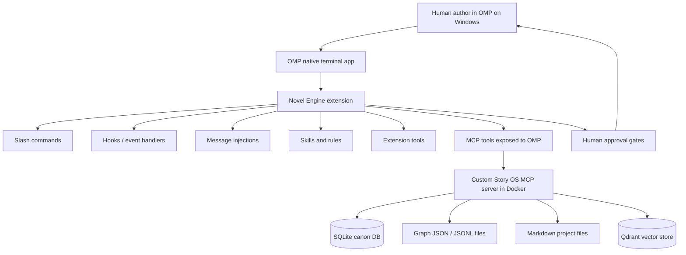
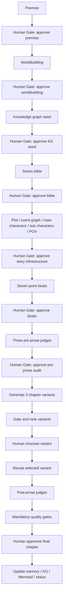

# Complete Build Specification: OMP Novel/Series/Serial Extension

## 1. Product definition

Working name: **OMP Novel Engine**.

The system is an OMP extension package for drafting, revising, auditing, and exporting:

1. standalone novels
2. finite novel series
3. indefinite web serials

It supports multiple genre profiles. Progression fantasy is a first-class configurable profile, not the only profile.

The extension package must include bundled `skills/`, `hooks/`, `tools/`, `commands/`, `rules/`, scripts, Docker files, and both `.omp/mcp.json` and root `.mcp.json`.

## 2. Hard requirements

The system must:

- run OMP natively on Windows
- run the custom MCP server and Qdrant through Docker Desktop
- use a custom MCP as the story operating system
- use OMP extension APIs, hooks, injections, scripts, skills, tools, commands, and rules
- enforce strict human-in-the-loop stop gates
- generate three chapter draft variants: `canon-tight`, `character-heavy`, and `plot-accelerated`
- explain why each variant differs before the human chooses
- apply seven-point structure as nested arcs
- use mandatory gates before marking a chapter complete
- output Markdown chapters and Mermaid diagrams
- keep all canon categories equally important
- store canon through hybrid SQLite + graph JSON/JSONL + Qdrant + Markdown frontmatter
- make model routing configurable in `.omp/novel-engine/config.yml`
- preserve the uploaded style, dialogue, AI-ism, revision, and progression-fantasy rules

## 3. Architecture



## 4. Required repository layout

```text
.omp/
  config.yml
  mcp.json
  extensions/novel-engine/
  hooks/
  skills/
  rules/story/
  novel-engine/config.yml
.mcp.json
docker/
  compose.yml
  story-os-mcp/
scripts/
stories/
references/
```

## 5. OMP config

`.omp/config.yml` discovers the extension and skills.

`.omp/mcp.json` is the canonical OMP MCP file. Root `.mcp.json` mirrors it for portable fallback compatibility.

## 6. Custom MCP: Story OS

The MCP owns durable story intelligence:

- project creation and project mode
- series bible
- worldbuilding memory
- knowledge graph
- event graph
- seven-point arcs and beats
- timeline and chronology
- canon facts
- character arcs
- relationships
- factions
- locations
- world rules
- progression systems and thresholds
- chapter/episode records
- variant records
- gate state
- audit findings
- Markdown export metadata
- Mermaid graph generation

The OMP extension is the orchestration/UI layer; MCP is the source of durable state.

## 7. Storage model

Use hybrid storage:

```text
SQLite       authoritative structured state
JSON/JSONL   graph projection and append-friendly canon logs
Markdown     user-facing story artifacts and frontmatter
Qdrant       vector retrieval only, not source of truth
```

Qdrant collections:

```text
novel_craft_docs
novel_canon_facts
novel_chapter_memory
novel_project_notes
```

## 8. MCP tools

The MCP server must expose these groups.

### Project tools

```text
story_project_create
story_project_open
story_project_status
story_project_config_get
story_project_config_update
story_project_mode_set
story_project_backup
```

### Canon and memory tools

```text
story_canon_upsert_fact
story_canon_get_fact
story_canon_search
story_canon_conflicts
story_canon_lock
story_canon_unlock
story_memory_add_chunk
story_memory_search
story_memory_summarize_scope
story_memory_reindex
```

### Knowledge graph tools

```text
story_kg_upsert_entity
story_kg_upsert_relationship
story_kg_upsert_event
story_kg_query
story_kg_neighbors
story_kg_export_mermaid
story_kg_import_jsonl
story_kg_export_jsonl
```

### Arc and seven-point tools

```text
story_arc_create
story_arc_get
story_arc_update
story_arc_validate_seven_point
story_arc_list_by_scope
story_arc_export_mermaid
```

Required arc scopes:

```text
serial_promise
season
book
subplot
major_character
chapter
episode
```

### Event graph and timeline tools

```text
story_event_graph_create
story_event_graph_upsert_node
story_event_graph_upsert_edge
story_event_graph_validate_causality
story_event_graph_export_mermaid
story_timeline_add_event
story_timeline_check
story_timeline_find_conflicts
```

### Planning tools

```text
story_premise_record
story_worldbuilding_record
story_series_bible_record
story_plot_options_generate
story_pov_plan_record
story_beatmap_record
story_chapter_outline_record
```

### Draft and variant tools

```text
story_chapter_variant_create
story_chapter_variant_list
story_chapter_variant_rank
story_chapter_variant_select
story_chapter_draft_record
story_chapter_complete_mark
```

### Gate and audit tools

```text
story_gate_create
story_gate_status
story_gate_record_human_decision
story_gate_blockers
story_audit_run
story_audit_get_report
story_audit_record_finding
story_audit_export_occurrence_inventory
```

### Export tools

```text
story_export_markdown_chapter
story_export_markdown_book
story_export_markdown_season
story_export_mermaid_diagrams
story_export_status_report
```

## 9. Seven-point structure

Use these beat names:

```text
Hook
First Plot Point
First Pinch
Midpoint
Second Pinch
Second Plot Point
Resolution
```

Aliases:

```text
Plot Turn I = First Plot Point
Pinch I = First Pinch
Pinch II = Second Pinch
Plot Turn II = Second Plot Point
```

For indefinite web serials:

```text
Serial Promise:
  Hook: sustaining premise/promise
  Resolution: deferred or periodically reinterpreted

Season or Book Arc:
  full seven beats and finite Resolution

Subplot Arc:
  full seven beats unless explicitly marked open-thread

Major Character Arc:
  full seven beats or marked in-progress

Chapter or Episode:
  seven-point diagnostic checklist, not necessarily seven scenes
```

## 10. Planning workflow



## 11. Multi-agent roles

Planning agents:

```text
Architect Agent
Worldbuilder Agent
KG Curator Agent
Series Bible Agent
Event Graph Planner
Character Arc Agent
POV Planner
Beat Planner
```

Pre-prose judges:

```text
Structure Judge
Canon/Continuity Judge
Character/Genre Judge
```

Drafting agents:

```text
Canon-Tight Draft Agent
Character-Heavy Draft Agent
Plot-Accelerated Draft Agent
```

Post-prose judges:

```text
Style Judge
Dialogue Judge
AI-ism Judge
```

## 12. Human stop gates

Gate statuses:

```text
pending
approved
rejected
needs_revision
blocked_by_audit
```

Strict rule:

```text
No downstream drafting step may run until the current gate is approved.
No chapter may be marked complete until all mandatory gates pass and the human approves.
No session_stop hook may continue prose drafting.
```

`session_stop` may only:

```text
save state
update MCP memory
update KG
queue audits
write resumable handoff note
```

## 13. Slash commands

```text
/novel:new
/novel:plan-series
/novel:plan-book
/novel:beatmap
/novel:draft-chapter
/novel:revise-chapter
/novel:audit
/novel:canon
/novel:export
/novel:status
/serial:plan-season
/serial:plan-arc
/serial:next-episode
/serial:recap
```

## 14. Hooks

Required hook behavior:

| Event | Behavior |
|---|---|
| `session_start` | Load active project, pending gates, current book/season/chapter, canon summary. |
| `context` | Inject relevant story memory only. |
| `before_provider_request` | Add hard constraints for current stage. |
| `tool_call` | Block unsafe destructive commands outside allowed paths. |
| `tool_result` | Validate generated files and record changed artifacts. |
| `session_before_compact` | Preserve canon facts, unresolved gates, open promises, current arc states. |
| `session.compacting` | Add compacted canon and chapter-state summary. |
| `session_stop` | Save state, update memory/KG, queue audits; never draft prose. |
| `user_bash` | Route risky project scripts through safe wrappers. |
| `user_python` | Prevent accidental DB/graph mutation outside MCP APIs. |
| `turn_end` | If a chapter artifact was produced, create the next human gate. |

## 15. Injections

Use OMP message delivery modes:

| Injection | Delivery mode | When used |
|---|---|---|
| Seven-point beat reminder | `nextTurn` | Before chapter or episode planning. |
| Relevant character/location facts | `nextTurn` | Before drafting or revising. |
| Style/dialogue/prose rules | `nextTurn` | Before prose drafting or revision. |
| Continuity warning | `followUp` | After draft generation. |
| Post-draft review queue | `followUp` | After all three variants exist. |
| Hard gate violation | `steer` | Only when approval gates or locked canon are violated. |
| Human approval prompt | UI dialog | Whenever a gate is pending. |

## 16. Skills

Required skills:

```text
seven-point-structure
novel-series-architecture
scene-drafting
chapter-outlining
character-arc
dialogue-naturalness
plain-physical-prose-revision
aiism-detection-cleanup
continuity-canon-audit
progression-fantasy-advancement
```

## 17. Mandatory quality gates

Pre-prose gates:

```text
Premise gate
Worldbuilding gate
Knowledge graph seed gate
Series bible gate
Plot/event/character/POV gate
Seven-point beat gate
Structure Judge gate
Canon/Continuity Judge gate
Character/Genre Judge gate
Human approval gate
```

Variant gates:

```text
Generate canon-tight variant
Generate character-heavy variant
Generate plot-accelerated variant
Explain why each variant differs
Run preliminary gate/rank pass
Human chooses one variant
Store rejected variants as non-canon drafts
```

Post-prose gates:

```text
Continuity and timeline check
Canon contradiction check
Character motivation check
Chapter goal and scene job check
Dialogue naturalness check
Narrator-distance hard-ban scan
Plain physical prose scan
AI-ism risk report
Style preservation check
Human final approval
```

## 18. Chapter variants

| Variant | Difference shown to human |
|---|---|
| Canon-tight | Best for continuity, exact beat adherence, lower invention, fewer canon risks. |
| Character-heavy | Best for emotional arc, relationship development, interior pressure, contradiction, subtext. |
| Plot-accelerated | Best for momentum, event density, cliffhanger pressure, serial readability. |

The report shown to the human must include:

```text
Variant ID
Purpose
What changed structurally
What changed emotionally
What changed in pacing
Canon risk
Continuity risk
Best use case
Reason to choose it
Reason not to choose it
```

Rejected variants remain non-canon unless restored by the human.

## 19. Progression-fantasy thresholds

Active only when the genre profile includes progression fantasy, LitRPG, cultivation, academy progression, system apocalypse, tower/dungeon progression, or similar mechanics.

Track:

```text
current capability
current limitation
visible threshold
cost ledger
training/practice evidence
social consequence
world-access consequence
new problem unlocked
next meaningful weakness
```

## 20. Output formats

User-facing exports:

```text
Markdown chapters
Mermaid diagrams
```

Required Mermaid files:

```text
diagrams/seven-point-map.mmd
diagrams/knowledge-graph.mmd
diagrams/event-graph.mmd
diagrams/character-arcs.mmd
diagrams/progression-thresholds.mmd
```

## 21. Scripts

```text
setup.ps1
docker-up.ps1
docker-down.ps1
mcp-smoke-test.ts
extension-smoke-test.ts
draft-book.ts
export-manuscript.ts
quality-scan.ts
backup-project.ts
reset-demo-project.ts
```

## 22. Path and safety policy

Block:

```text
writing outside project root
deleting story project directories without explicit human confirmation
editing canon.db directly outside MCP migration tools
writing selected variant over approved chapter without backup
marking gates approved from model output alone
marking chapter complete without human approval
session_stop drafting
```

## 23. Canon categories

All canon categories are equally important:

```text
characters
character emotional arcs
relationships
world rules
magic/progression/system rules
timeline
chronology
locations
spatial continuity
objects
factions
institutions
open promises
mysteries
foreshadowing
payoffs
theme/motif
POV rules
style/voice rules
```

## 24. Reports

Every full audit report must include:

```text
Overall verdict
Ratings
What works
Count summary
Exhaustive occurrence inventory
Main AI-ism patterns
Banned narrator-distance constructions
Why an AI system might produce this
Prioritized revision plan
Do-not-change notes
```

Do not claim proof of AI authorship. Report pattern risk only.

## 25. Development phases

### Phase 1: OMP extension skeleton

```text
extension loads
commands register
skills discovered
hooks load
config loads
MCP client connects
/novel:status works
```

### Phase 2: Docker MCP and storage

```text
Docker Compose starts MCP and Qdrant
SQLite migrations run
MCP tool list visible to OMP
project_create works
canon upsert/search works
graph JSONL writes
```

### Phase 3: Planning pipeline

```text
/novel:new
premise gate
worldbuilding gate
KG seed
series bible
event graph
character/POV plan
seven-point beatmap
Mermaid export
```

### Phase 4: Chapter workflow

```text
pre-prose judges
three variants
variant ranking
human choice
selected draft revision
post-prose judges
mandatory gates
chapter approval
memory/KG update
```

### Phase 5: Serial support

```text
/serial:plan-season
/serial:plan-arc
/serial:next-episode
/serial:recap
open promise ledger
season completion report
```

### Phase 6: Hardening

```text
path safety
backup/restore
quality-scan script
demo project reset
smoke tests
Windows setup docs
```

## 26. Definition of done

The extension is complete when:

```text
OMP discovers and loads the extension from .omp/extensions
OMP discovers all ten skills
OMP loads hook modules
OMP connects to the custom MCP through .omp/mcp.json
Docker starts MCP and Qdrant through scripts
SQLite, graph JSONL, Markdown, and Qdrant are all used
/novel:new creates a project
/novel:beatmap creates nested seven-point arcs
/novel:draft-chapter produces three variants
the human sees why each variant differs
the human must approve before moving forward
post-prose gates run
hard narrator-distance bans are scanned
plain physical prose scan runs
dialogue naturalness scan runs
AI-ism occurrence inventory is produced
chapter cannot be marked complete without all mandatory gates and human approval
Markdown chapter export works
Mermaid diagram export works
session_stop never drafts prose
```
